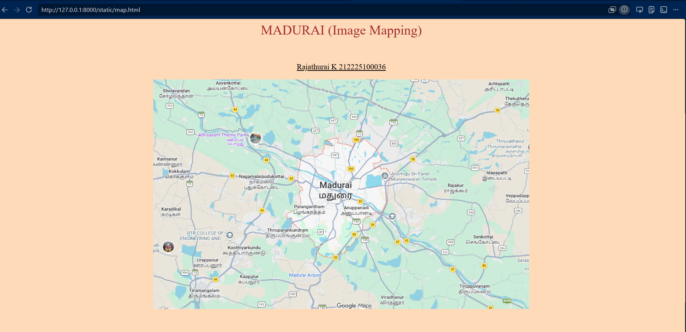
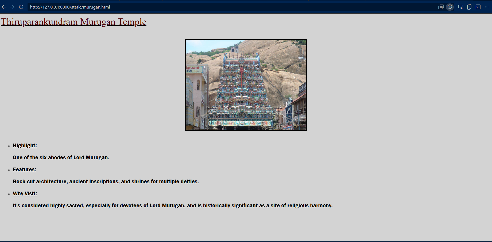
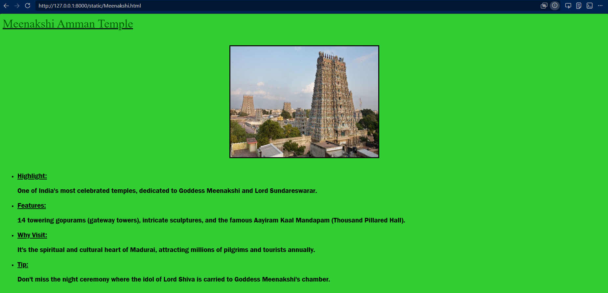
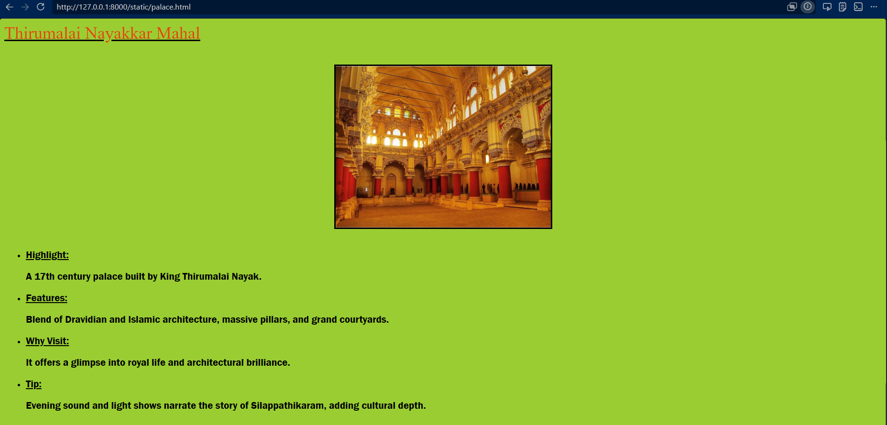
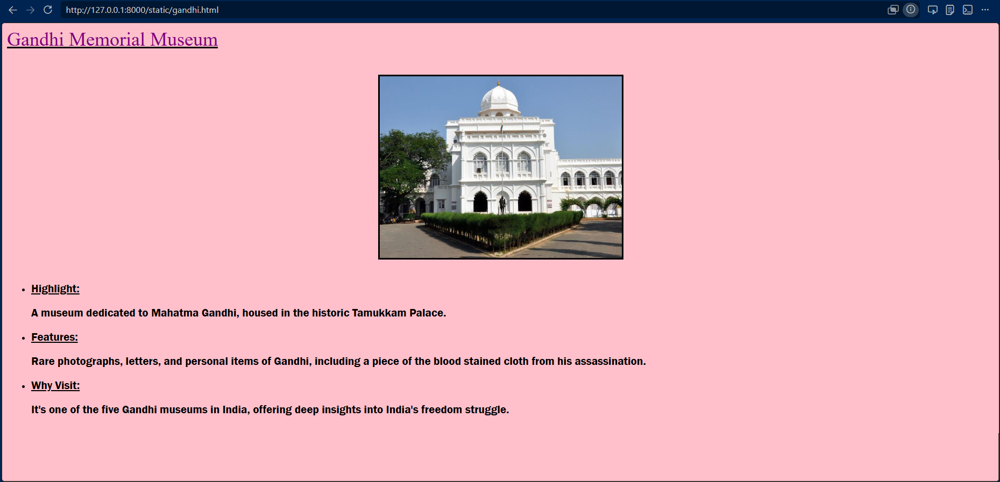
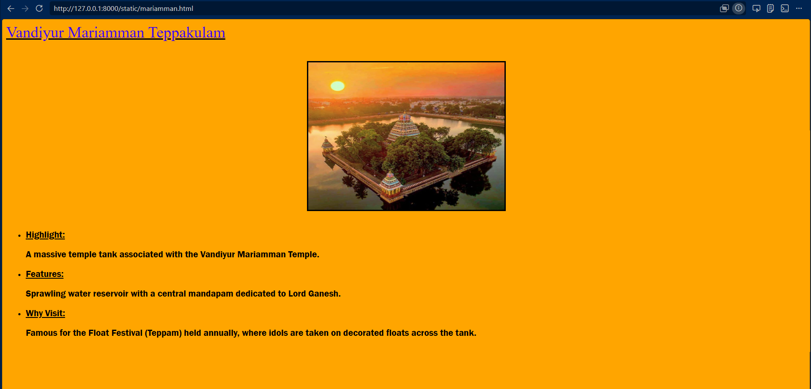

# Ex03 Places Around Me
## Date: 20.05.2026

## AIM
To develop a website to display details about the places around my house.

## DESIGN STEPS

### STEP 1
Create a Django admin interface.

### STEP 2
Download your city map from Google.

### STEP 3
Using ```<map>``` tag name the map.

### STEP 4
Create clickable regions in the image using ```<area>``` tag.

### STEP 5
Write HTML programs for all the regions identified.

### STEP 6
Execute the programs and publish them.

## CODE

### map.html

```
<html>
    <head>

    </head>
    <body bgcolor="peachpuff">
        <center><h1 style="color:brown; font-weight: 100;">MADURAI (Image Mapping)</h1></center><br>
        <center><u><h3 style="font-weight: 100;">Rajathurai K 212225100036</h3></u></center>
        <center></center>
        <map name="mdumap">
            <area shape="rect" coords="300,220,400,320" href="Meenakshi.html" alt="Meenakshi Amman Temple">
            <area shape="rect" coords="500,300,600,400" href="palace.html" alt="Thirumalai Nayakkar Mahal">
            <area shape="rect" coords="200,400,300,500" href="gandhi.html" alt="Gandhi Memorial Museum">
            <area shape="rect" coords="600,100,700,200" href="mariamman.html" alt="Vandiyur Mariamman Teppakulam">
            <area shape="rect" coords="100,100,200,200" href="murugan.html" alt="Thiruparankundram Murugan Temple">
        </map>
    </body>
</html>
```
### mariamman.html
```
<html>
    <head>

    </head>
    <body bgcolor="orange">
        <u><h1 style="color: rgb(61, 7, 226); font-weight: 100;">Vandiyur Mariamman Teppakulam</h1></u><br>
        <center></center><br>
        <ul>
            <li style="font-family: 'Franklin Gothic Medium', 'Arial Narrow', Arial, sans-serif;"><h3><u>Highlight:</u><br><p>A massive temple tank associated with the Vandiyur Mariamman Temple.</p></h3></li>
            <li style="font-family: 'Franklin Gothic Medium', 'Arial Narrow', Arial, sans-serif;"><h3><u>Features:</u><br><p>Sprawling water reservoir with a central mandapam dedicated to Lord Ganesh.</p></h3></li>
            <li style="font-family: 'Franklin Gothic Medium', 'Arial Narrow', Arial, sans-serif;"><h3><u>Why Visit:</u><br><p>Famous for the Float Festival (Teppam) held annually, where idols are taken on decorated floats across the tank.</p></h3></li>
        </ul>
    </body>
</html>
```
### Meenakshi.html
```
<html>
    <head>

    </head>
    <body bgcolor="limegreen">
        <u><h1 style="color: darkgreen; font-weight: 100;">Meenakshi Amman Temple</h1></u><br>
        <center></center><br>
        <ul>
            <li style="font-family: 'Franklin Gothic Medium', 'Arial Narrow', Arial, sans-serif;"><h3><u>Highlight:</u><br><p>One of India's most celebrated temples, dedicated to Goddess Meenakshi and Lord Sundareswarar.</p></h3></li>
            <li style="font-family: 'Franklin Gothic Medium', 'Arial Narrow', Arial, sans-serif;"><h3><u>Features:</u><br><p>14 towering gopurams (gateway towers), intricate sculptures, and the famous Aayiram Kaal Mandapam (Thousand Pillared Hall).</p></h3></li>
            <li style="font-family: 'Franklin Gothic Medium', 'Arial Narrow', Arial, sans-serif;"><h3><u>Why Visit:</u><br><p>It's the spiritual and cultural heart of Madurai, attracting millions of pilgrims and tourists annually.</p></h3></li>
            <li style="font-family: 'Franklin Gothic Medium', 'Arial Narrow', Arial, sans-serif;"><h3><u>Tip:</u><br><p> Don't miss the night ceremony where the idol of Lord Shiva is carried to Goddess Meenakshi's chamber.</p></h3></li>
        </ul>

    </body>
</html>
```
### murugan.html
```
<html>
    <head>

    </head>
    <body bgcolor="lightgrey">
        <u><h1 style="color: rgb(79, 3, 3); font-weight: 100;">Thiruparankundram Murugan Temple</h1></u><br>
        <center></center><br>
        <ul>
            <li style="font-family: 'Franklin Gothic Medium', 'Arial Narrow', Arial, sans-serif;"><h3><u>Highlight:</u><br><p>One of the six abodes of Lord Murugan.</p></h3></li>
            <li style="font-family: 'Franklin Gothic Medium', 'Arial Narrow', Arial, sans-serif;"><h3><u>Features:</u><br><p>Rock cut architecture, ancient inscriptions, and shrines for multiple deities.</p></h3></li>
            <li style="font-family: 'Franklin Gothic Medium', 'Arial Narrow', Arial, sans-serif;"><h3><u>Why Visit:</u><br><p> It's considered highly sacred, especially for devotees of Lord Murugan, and is historically significant as a site of religious harmony.</p></h3></li>
        </ul>
    </body>
</html>
```
### palace.html
```
<html>
    <head>

    </head>
    <body bgcolor="yellowgreen">
        <u><h1 style="color: rgb(223, 72, 17); font-weight: 100;">Thirumalai Nayakkar Mahal</h1></u><br>
        <center></center><br>
        <ul>
            <li style="font-family: 'Franklin Gothic Medium', 'Arial Narrow', Arial, sans-serif;"><h3><u>Highlight:</u><br><p>A 17th century palace built by King Thirumalai Nayak.</p></h3></li>
            <li style="font-family: 'Franklin Gothic Medium', 'Arial Narrow', Arial, sans-serif;"><h3><u>Features:</u><br><p>Blend of Dravidian and Islamic architecture, massive pillars, and grand courtyards.</p></h3></li>
            <li style="font-family: 'Franklin Gothic Medium', 'Arial Narrow', Arial, sans-serif;"><h3><u>Why Visit:</u><br><p>It offers a glimpse into royal life and architectural brilliance.</p></h3></li>
            <li style="font-family: 'Franklin Gothic Medium', 'Arial Narrow', Arial, sans-serif;"><h3><u>Tip:</u><br><p>Evening sound and light shows narrate the story of Silappathikaram, adding cultural depth.</p></h3></li>
        </ul>
    </body>
</html>
```
### gandhi.html
```
<html>
    <head>

    </head>
    <body bgcolor="pink">
        <u><h1 style="color: purple; font-weight: 100;">Gandhi Memorial Museum</h1></u><br>
        <center></center><br>
        <ul>
            <li style="font-family: 'Franklin Gothic Medium', 'Arial Narrow', Arial, sans-serif;"><h3><u>Highlight:</u><br><p>A museum dedicated to Mahatma Gandhi, housed in the historic Tamukkam Palace.</p></h3></li>
            <li style="font-family: 'Franklin Gothic Medium', 'Arial Narrow', Arial, sans-serif;"><h3><u>Features:</u><br><p>Rare photographs, letters, and personal items of Gandhi, including a piece of the blood stained cloth from his assassination.</p></h3></li>
            <li style="font-family: 'Franklin Gothic Medium', 'Arial Narrow', Arial, sans-serif;"><h3><u>Why Visit:</u><br><p> It's one of the five Gandhi museums in India, offering deep insights into India's freedom struggle.</p></h3></li>
        </ul>
    </body>
</html>
```

## OUTPUT













## RESULT
The program for implementing image maps using HTML is executed successfully.
